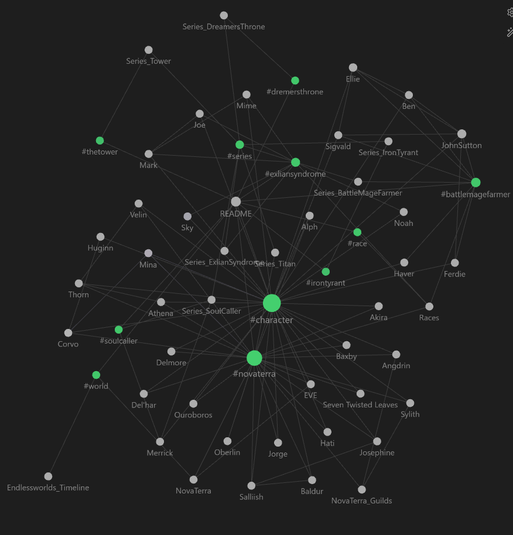

# Endless Worlds Wiki

> **_DISCLAIMER:_** This is a fan made wiki and is not directly affiliated with Seth Ring. Please be aware that there are spoilers throughout this wiki and this disclaimer may not be posted on every page.

> **_WARNING:_** There are spoilers throughout this wiki.

## Overview

The Endless Worlds are a universe of stories written by the author [Seth Ring](https://sethring.com/about-seth-ring/) that span across several different series, all with their own unique characters and timeline.

## Start here: [INDEX](Topics/INDEX/INDEX.md)

## How to use the wiki on desktop

This project can be cloned to a desktop and opened using the note taking application [Obsidian](https://obsidian.md/) which can display the notes and their links to other notes or tags in a dynamic graph. Simply download a copy of the project, unzip it to a folder, then open that folder as a vault from the Obsidian main window.

## Contributing to the wiki

All are welcome to contribute to the wiki using a pull request (PR), however, the project maintainers reserve the right to decline PRs.

- Create a PR to start a new topic file or to edit a file.
- Please keep the scope of a PR short in order to expedite the review and merging process
- The "Issues" section may be used to discuss any fan theories

### Contribution rules

1) Please use the Obsidian desktop application for the best management of changes to file names, links, etc.
2) When creating a new topic, add at least one tag to the top of the file and add a link to that file within the proper tag group (alphabetized) in the INDEX document.
3) Unless the information was directly discovered in one of the books, please site sources of information at the bottom of the topic

## Author's Links

- https://sethring.com/
- https://www.youtube.com/@SethRingWrites
- https://www.facebook.com/sethringwrites
- https://www.tiktok.com/@sethringtheauthor
- https://x.com/sethring
- https://www.instagram.com/mrsethring/
- https://reamstories.com/sethring/public
- https://www.patreon.com/SethRing (Inactive)

https://www.facebook.com/groups/novaterrafanclub

---
## Sources

- https://sethring.com/
- https://www.novaterra.wiki/
- https://nova-terra.fandom.com/
