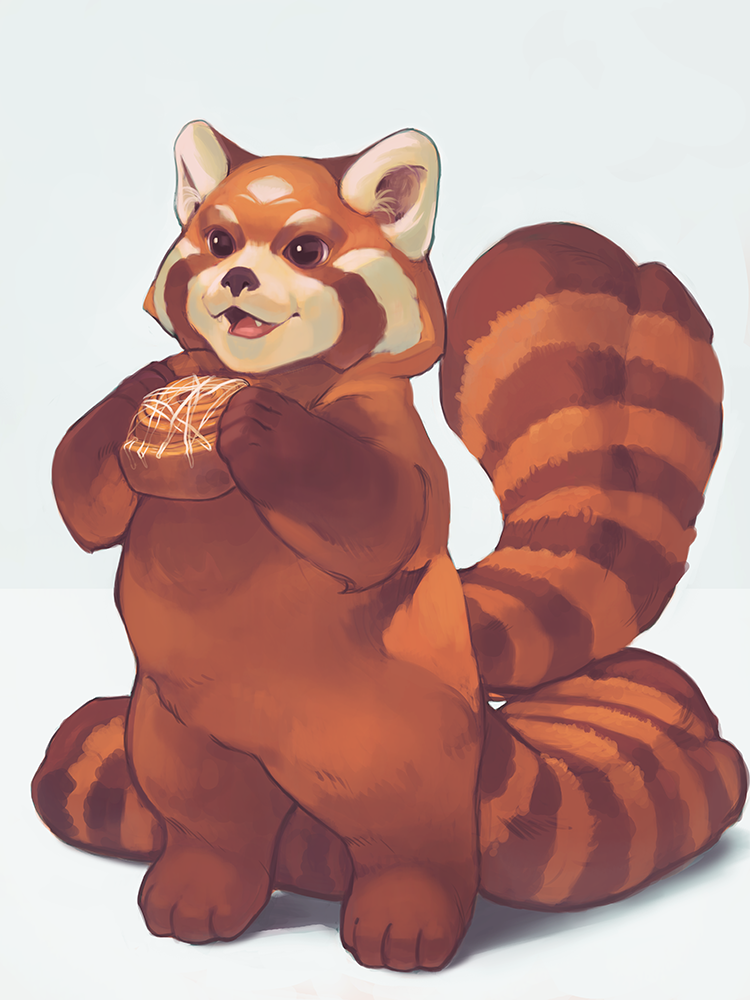

# Akira the Royal Aluridae

Thorn's battle pet, the three tailed royal aluridae loves sweet treats and destroying enemies.

## Backstory

Found under a log in Nova Terra, Akira joined Thorn's team via spirit contract after Thorn won her over by offering her endless pastries.

## Appearances

## Physical Description

### Pet form

### Battle form

## Relatives

- Soul Bond: [Thorn](Thorn.md)

## Images

(By https://www.instagram.com/laurenwalshart/)

---
## Sources
- 
