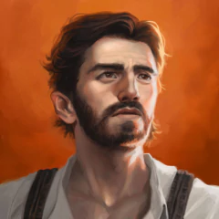

# John Sutton

While John Sutton may be the most powerful man on the planet, all he wants now is to leave that power behind.

## Backstory

## Appearances

- [Battle Mage Farmer (Book #1): "Domestication"](../BattleMageFarmer/Series_BattleMageFarmer.md#Book%201%20Domestication)
- [Battle Mage Farmer (Book #2): "Germination"](../BattleMageFarmer/Series_BattleMageFarmer.md#Book%202%20Germination)
- [Battle Mage Farmer (Book #3): "Cultivation"](../BattleMageFarmer/Series_BattleMageFarmer.md#Book%203%20Cultivation)
- [Battle Mage Farmer (Book #4): "Fermentation"](../BattleMageFarmer/Series_BattleMageFarmer.md#Book%204%20Fermentation)
- [Battle Mage Farmer (Book #5): "Transformation"](../BattleMageFarmer/Series_BattleMageFarmer.md#Book%205%20Transformation)
- [Battle Mage Farmer (Book #6): "Preservation"](../BattleMageFarmer/Series_BattleMageFarmer.md#Book%206%20Preservation)
- [Battle Mage Farmer (Book #7): "Separation"](../BattleMageFarmer/Series_BattleMageFarmer.md#Book%207%20Separation)
- [Battle Mage Farmer (Book #8): "Conservation"](../BattleMageFarmer/Series_BattleMageFarmer.md#Book%208%20Conservation)
- [Battle Mage Farmer (Book #9): "Culmination"](../BattleMageFarmer/Series_BattleMageFarmer.md#Book%209%20Culmination)

## Physical Description

- Origin: Earth
- Race: Human...?

## Relatives

- Wife: [Ellie Sutton](Characters/Ellie.md)
- Brother in law: [Ben](Characters/Ben.md)

## Images

---
## Sources
- https://sethring.com/book-series/battle-mage-farmer-series/