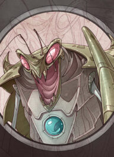

# Races

## Animal-kin

Humanoid animals

### Dragonkin

### Lizardkin

### Tigerkin

### Wolfkin

## Dwarf

## Elf

## Exlian

As they absorb mana, Exlian metamorphose into bigger, more powerful forms. They can also acquire abilities of humans by feeding on their brains.

Small and basic, drones can evolve into any type of warrior.

Evolved for combat, different strains of warriors vary widely.

The deadliest Exlian, Terrors have absorbed human skills and intelligence.

Matrons control the minds of other Exlian to coordinate attacks on humans.

## Human

## Godbeast

---
## Sources
- 