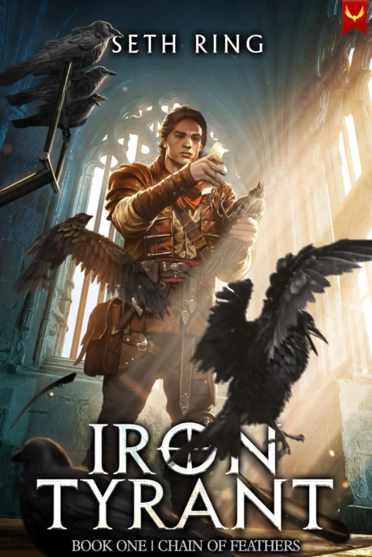
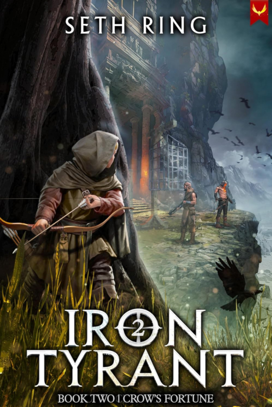
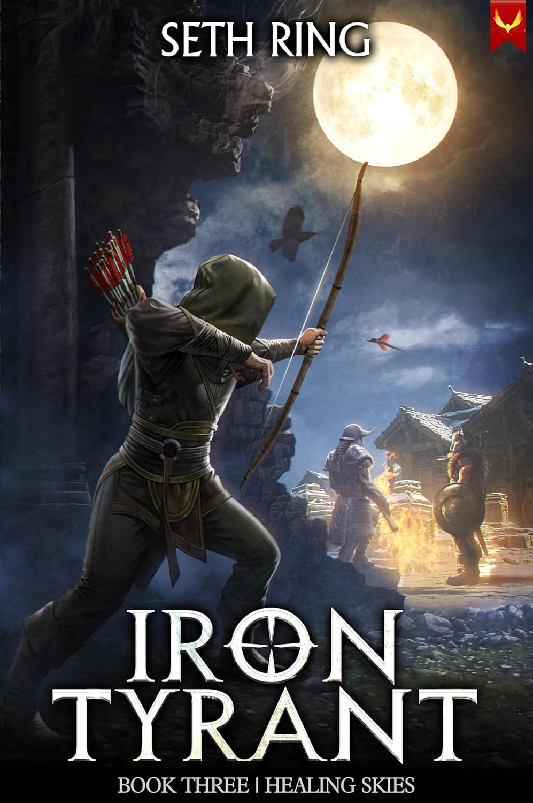

# Iron Tyrant

{Series Logo TBD}

Mateo has been blindsided by the one person he trusted more than anyone: his kindly master.

Now, he finds himself in a military training camp where survival is a fierce and bloody struggle. Mateo’s only way out is to become a Duelist—a soldier of supernatural power. But his luck gets even worse when he’s stuck with the lowest Root Card, slowing his progress and leaving him vulnerable in a merciless world.  
With two strangers at his side and a mysterious crow spirit linked to his soul, Mateo must defy all odds if he hopes to make it out of training camp alive.

## Book 1: Chain of Feathers

### Released: October 29, 2024

### Plot

Roll over and die, or become so strong nothing can stop him.

Cast into a brutal military camp by his once loving master, Mateo feels like the last six wonderful years of his life have been a lie. With the mysteries surrounding him growing, Mateo knows that his only option is becoming one of the supernaturally powerful Duelists and growing in power until he can take his fate into his own hands.

That plan is thwarted from the beginning when he gets stuck with the lowest ranked Root Card against his will, ensuring that his growth as a Duelist will always be excruciatingly slow. To make matters worse, the camp he has been thrown into is completely cutthroat and survival isn’t guaranteed by a long shot.

## Book 2: Crow's Fortune

### Released: January 29, 2025

### Plot

Mateo has survived his training so far. But it's far from over.

Having passed his initial assessment, Mateo has been assigned to learn the craft of the Dark Wing, the information gathering branch of the Iron Wing Army. But it quickly becomes apparent that Dark Wing does a lot more than gather information when he is sent to infiltrate an enemy city to pave the way for a surprise attack.

As Mateo’s personal power continues to grow he’ll learn that it takes a lot more than strength to navigate the complex web of intrigue between nations. Yet no matter how adept he becomes, it is impossible to avoid being drawn into the maelstrom that surrounds the ambitious imperial family, leaving Mateo with no choice but to commit himself to supporting the young Fifth Prince.

Together with his friends and his spirit bond, Corvus, Mateo will continue to uncover the truth about the world, the mysterious Solomon order, and the treacherous path his master planned for him.

## Book 3: Healing Skies

### Released: May 14, 2025

### Plot

#tbd

---
## Sources
- https://sethring.com/book-series/iron-tyrant/
