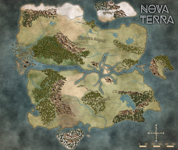

Tags: #world, #novaterra

---
# Nova Terra

## Real World

The stories are set in Earth's future. Corporations are large and powerful. Medicine and technology has advanced significantly. Nation-states still exist. Virtual reality is commonplace and immersive, and individuals in VR are sustained by gaming pods that enable them to enter a “flow state” which dilates time such that they spend more time in VR than passes in the real world (7 hrs in VR = 1 hr in RW). While there are many virtual experiences in the future, there are two in particular where most people spend their time.

## Virtual World

The biggest and most popular virtual realities are known as Nova Terra and Fantasia, both created by the same company, Horizon. Nova Terra is a vast fantasy world with its own history, culture, and economy that allows individuals to do nearly anything they can do in the real world, but with a few perks such as magic, mastery (which unlocks new skills/abilities), and non-permanent death. Fantasia is a virtual city where individuals can socialize and carry out business. Due to the number of people playing Nova Terra, in-game results can have significant economic benefits in the real world, i.e. from sale of goods or controlling access to important areas

Nova Terra is an open world with a deep history and in which most of the lore is hidden, as is non-basic information about the game more generally. Players advance by following quest lines that they discover during their play. There is no level-up system as such in the game, instead players acquire classes and titles which grant them certain abilities. Classes can be improved through practice, and mastery bonuses are applied once a certain skill level is reached. There are also several character types in the game that players can interact with. As with other Massively Multiplayer Virtual Reality Role Playing Games (MMVRRPG), play styles include solo play and group play, with group play facilitated by guilds.

## Gods & their Avatars

- Hati the Moon Wolf & Thorn
- Huginn the Raven & Corvo
- Salliish the Shadow Serpent & Josephine
-  

## Images

---
## Sources
- https://www.novaterra.wiki/doku.php?id=world
- https://www.novaterra.wiki/doku.php?id=game