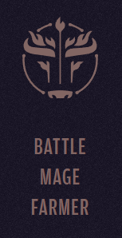
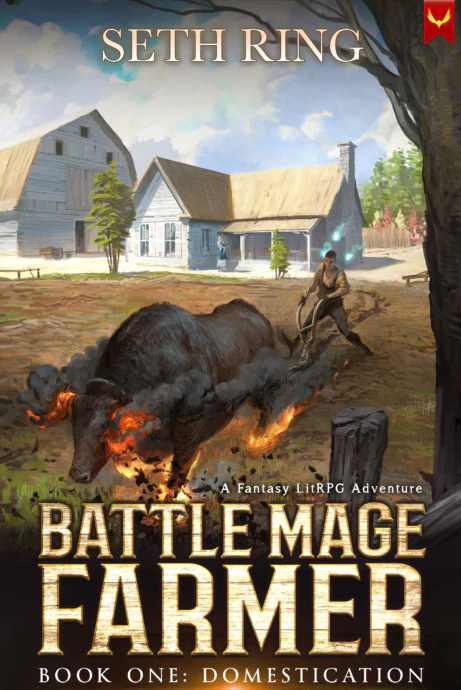
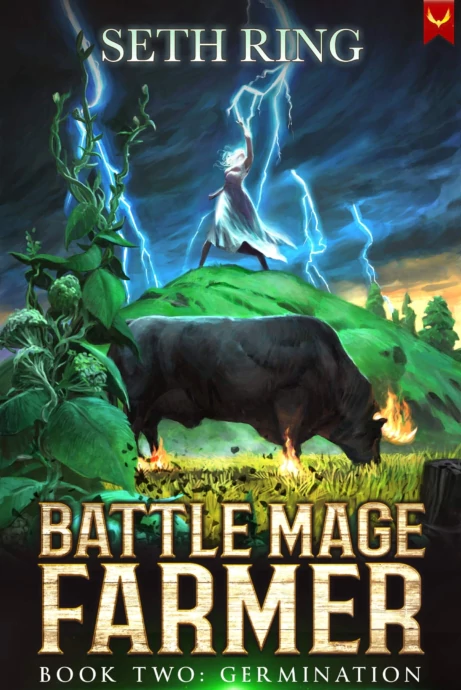
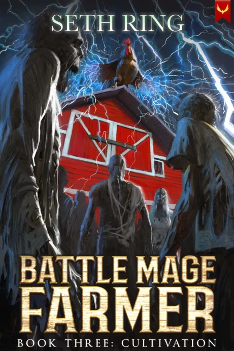
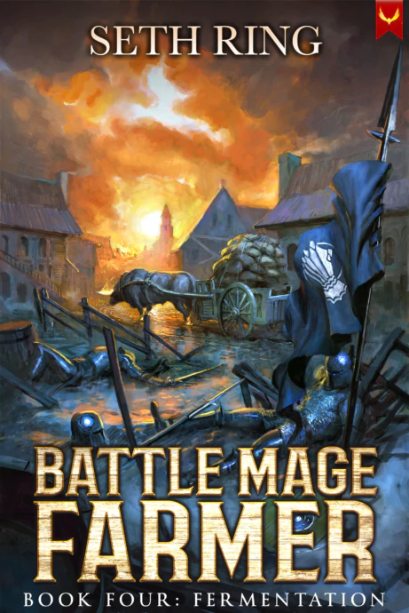
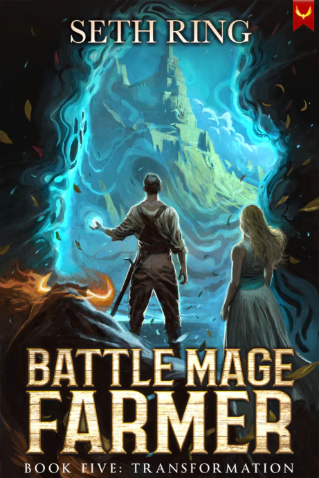
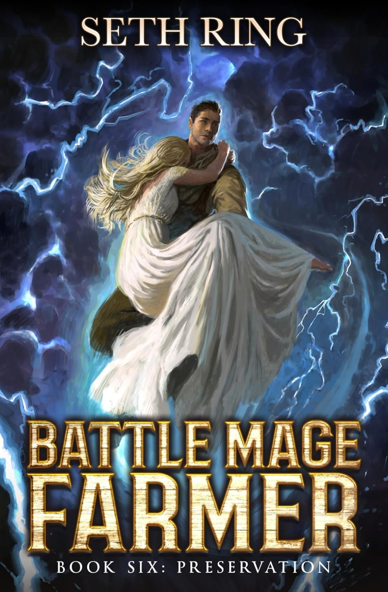
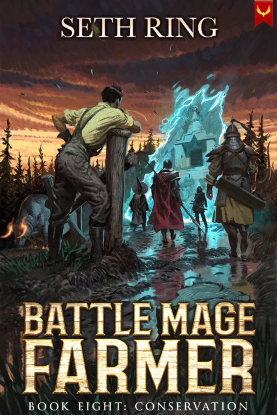
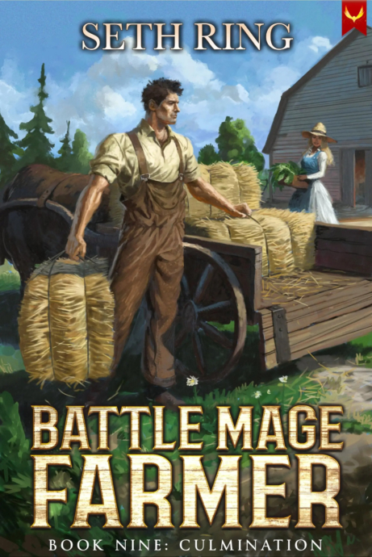

Tags: #series, #battlemagefarmer

---
# Battle Mage Farmer

If the question were one of sheer power, John Sutton would have nothing to worry about.

After earning his discharge from the royal army, he’s been granted a farm in a remote mountain valley. But despite years of crushing his enemies and gaining near-limitless abilities, John still hasn’t cracked the rules of the game. Now, his Doom Points have begun ticking higher—and John can’t make out why. All he knows is that once his Doom Points reach 100, the apocalypse begins. Unfortunately for John’s retirement plans, the fate of the world now rests on his shoulders. Again.

Oh, and there’s also the farm to run.

## Book 1: Domestication

### Released: May 31, 2022

### Plot

A world on the precipice of the apocalypse. A secret forged in the flames of war. A chance to start over. For John Sutton, only one of those three things matters.

Retired from a decade of brutal war, he wants nothing more than a quiet pastoral life while he does his best to stem the steady increase of his Doom Points before they hit 100, signaling the start of the end. He’s been given a small farm on the outskirts of the empire as a thanks for his service, but no matter how far he travels, it’s impossible to escape the war’s devastating effects on the world.

## Book 2: Germination

### Released: August 23, 2022

### Plot

For John Sutton, things are finally looking up… For now…

The farm is running smoothly, the local bandits have been pacified, and he is starting to understand how magic works. Though none of that will matter if he can’t get his Doom Points under control.

As Ellie seeks to join the ranks of Class Holders, the mystery surrounding her grandmother grows and the two of them set off to discover the truth. But her legacy as a Witch is not the only mystery that needs to be explored. A strange plant is growing in Ferdie’s field, and it’s given John a new quest.

## Book 3: Cultivation

### Released: November 22, 2022

### Plot

With the mystery of the world deepening, John Sutton is running out of time.

The apocalypse is approaching as his Doom Points tick up and John is finding it harder and harder to keep it together. His deepening knowledge of magic seems to be helping but as a hidden society creeps out of the shadows, intent on throwing the world into chaos, it may not be enough.

## Book 4: Fermentation

### Released: February 22, 2023

### Plot

John has failed. The apocalypse has come.

But it’s been awfully quiet for an apocalypse. After stopping Kythov the Eyeless, John and the gang barely managed to stabilize the world’s mana supply, only sort of poisoning the world in the process. With a farm to run, a valley to develop, and a mysterious door to another dimension to study, John is going to have his hands full.

Even worse, despite the apparent peace, turmoil stirs and ancient threats have begun to surface. When a mysterious tower of mages arrives in the valley, bent on enslaving the people under John’s watch, he and Ellie are forced to take a trip to try and determine if they are friend or foe. At the same time, the powerful new emperor of Allera has ordered his implacable army to raze Lepiera’s capital, where Ben happens to be apprenticing, to the ground.

## Book 5: Transformation

### Released: May 24, 2023

### Plot

Just when John thinks things are finally calming down, the world never fails to throw a new twist his way. And the latest one is deadly.

A distress call from Katrine has set John on a crash course with a band of vicious dimensional raiders led by a supreme mage who are already planning an invasion, while back home, the clock is ticking on the prophecy of the beast invasion that will wipe humans from the face of the world.

## Book 6: Preservation

### Released: August 15, 2023

### Plot

Insane cult trying to undermine the stability of society? Powerful mage whose very presence unmakes the world?  
  
John doesn’t care. He’s getting married.  
  
After rescuing Katrine, sealing himself into a manaless state, and defending against the most dangerous beast tide the world has ever seen, John only has one thing on his mind. Getting married, and going on a honeymoon. Oh, and trying to figure out a way to keep the world in one piece.  
  
That quest will take him to worlds unknown, and pit him against enemies beyond anything he has ever faced. Thankfully, he’s not alone, and between Ellie and Ferdie, he has the best companions a simple farmer could ask for.

## Book 7: Separation

### Released: January 23, 2024

### Plot

Urey Lotheric, Supreme Mage of the Cabal of the Broken Gate has been vanquished, and the valley has been saved from certain destruction.

But none of that will matter if John can’t find a way back to Candle Scholar Tower. Stranded in the void with Ferdie and Ellie, John has to find a way to get access to the valley, or risk being separated from his farm forever.

## Book 8: Conservation

### Released: June 19, 2024

### Plot

For John Sutton, rest is just around the corner. Soon it will be time to sit on his porch, kick his feet up, and watch his wheat grow. All he has to do first is fight his way through a cutthroat magic competition held once every thousand years, navigating mage politics and an aggressive dragon empire bent on punishing him for Farroutef’s death.

When his journey takes him to a strange new world, John finds himself out of place once again, making him wonder if he should just walk away for good, until an encounter with a local god sets him on a new path, teaching him more about himself than he knew was possible.

## Book 9: Culmination

### December 11, 2024

### Plot

They started the fight. John is going to end it.  
  
Despite John’s best efforts to avoid getting pulled into a war, the Resplendent Empire is determined to crush John and Candle Scholar Tower. No sooner had he returned from the once a millennium magical competition than he discovers that the Empire has declared war, confident that they will be able to roll over John and his allies with little trouble.  
  
Yet little do they know what sort of force they have provoked. No longer a man of two minds, John sets out to end things once and for all. As the Dragon Empress Kalmeric marshal’s her forces, John puts the lessons he learned on the battlefield all those years ago to work.  
  
Venturing out from his beloved farm, John is intent on making this adventure his last so he can spend the rest of his days sitting on his porch watching his wheat grow next to those he loves.

---
## Sources
- https://sethring.com/book-series/battle-mage-farmer-series/