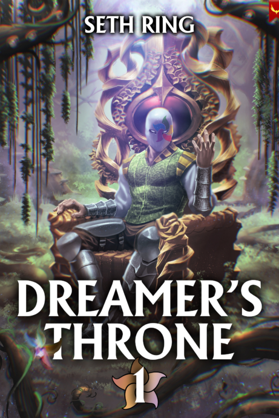
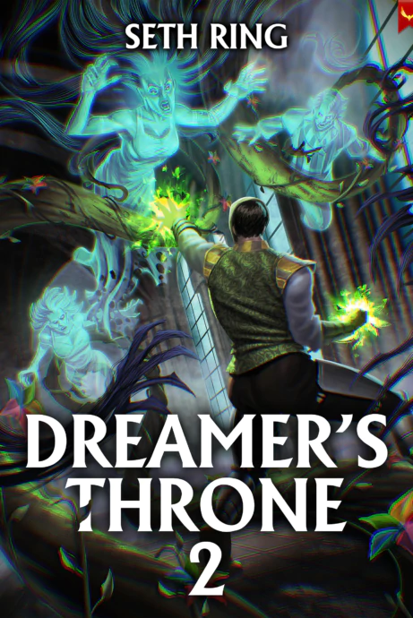
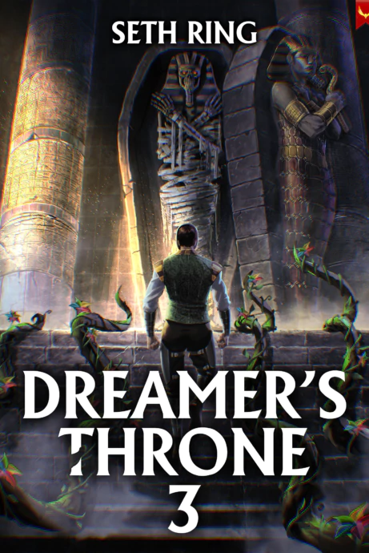
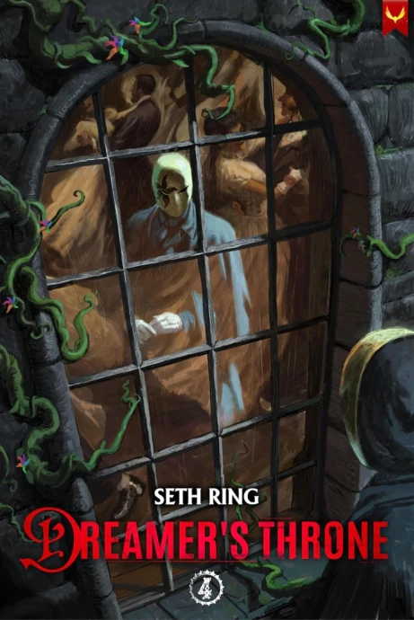

Tags: #series #dremersthrone  

---
# Dreamer's Throne

A broken body. A mysterious world. It’ll take all his intelligence to stay alive.

When Garrett wakes up paralyzed on the floor of a gang leader’s house, the most important question isn’t how he got there. It’s how he’s going to survive a new reality full of violence, shifting alliances, and a game system he doesn’t understand.

Combining elements of light horror, epic fantasy, mystery, and guild building, Dreamer’s Throne follows Garrett as he fights for his life—and learns that strength is more than muscle.

## Book 1: Dreamer's Throne 1

### Released: September 19, 2023

### Plot

A broken body. A mysterious world. It’ll take all his intelligence to survive.

After a close brush with death, Garrett realizes that he’s in a new world. And worse, he’s missing an arm and paralyzed from the waist down. A fact that doesn’t deter the brutal gang lord whose floor he’s crashing on from wanting to throw him out into the street.

The only thing standing between Garrett and a cold death at the mercy of the city’s scavengers are his own wits and a plucky young woman. Armed with a System that gives him experience for exploring his new world, Garrett is determined to do whatever it takes to keep himself safe from the threats closing in all around him. Even if it means becoming a villain. But the inn and city are far from what they seem.

## Book 2: Dreamer's Throne 2

### Released: December 20, 2023

### Plot

Garrett has survived nightmares come to life and an insane murderer bent on carving his body to pieces, but that doesn’t mean the fight is over. Banding together with the remnants of the Ghoul’s Tooth gang, Garrett finds himself thrust into a power struggle he wants nothing to do with. The city is filled with warring factions, each bent on using every means possible to come out on top, and they all seem to think Garrett is the perfect tool to achieve that.

With merchants coming after the gang’s successful soap business, the city guard breathing down their necks, other gangs eyeing their territory, and a nightmarish demi-god watching from the shadows, it’s going to take all of Garrett’s wits and courage to keep his new family from falling apart.

## Book 3: Dreamer's Throne 3

### Released: March 20, 2024

### Plot

Night has fallen and the dead have begun their march. Garrett’s power is growing, and with it the influence of the dream flowers. But with power comes enemies, and Garrett’s enemies outclass him by a large margin. To make matters worse, one of the Great Rulers of the Dream has launched his attack on the budding Klein Family, intending to consume Garrett and expand his territory.

With the March of Lesrak underway, the gangs of the city have a simple choice. Band together or die under the claws of the wave of zombies sweeping the city. To make matters worse, the powerful cabal of necromancers lurking in the shadows of the zombie horde are bent on ensuring that the gangs are too preoccupied to stop the undead from eating everyone in the district.

## Book 4: Dreamer's Throne 4

### Released: June 26, 2024

### Plot

Nightmares have nothing on politicians. Surviving a fight with an immortal necromancer should have bought Garrett some peace, but when the Princess he thought was dead shows up on his doorstep, any chance of an easy time slips away. Together with the Klein Family, Garrett will have to navigate a danger far greater than any he has faced in the dream world.

To make matters worse, his father now knows he is alive and is bent on using Garrett for his own nefarious agenda. Backstabbing merchants, cutthroat gangs, and nobles willing to use any and every means to claw their way into power have all set their sights on the up and coming Klein Family to get what they want.

Garrett will have to use every ounce of his wits, creativity, power, and endurance to keep from being pulled under in the swirling maelstrom of political intrigue sweeping the city.

---
## Sources
- https://sethring.com/book-series/dreamers-throne-series/