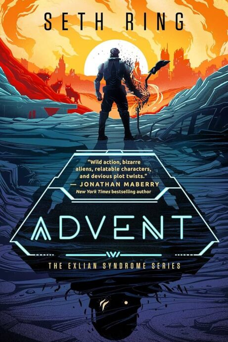
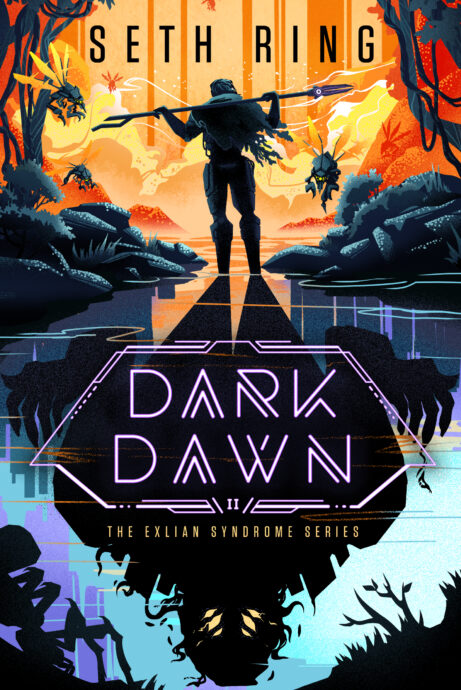
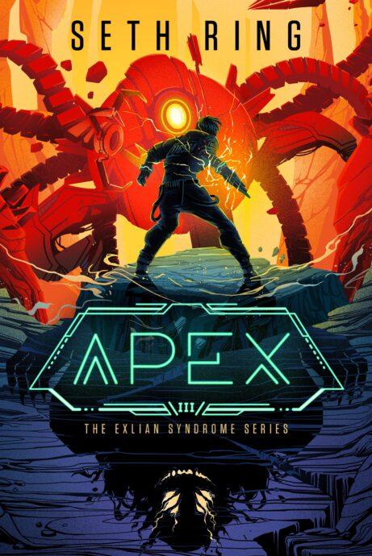

Tags: #series #exliansyndrome   

---
# The Exlian Syndrome

What happens when humanity’s greatest source of power is also its greatest threat?

Exlian are an alien species that generate mana—the most potent energy on the planet. They’re also brutal predators, and their relentless attacks have forced civilization into retreat. Mark Fields might just be the hero his city needs. But only if the authorities—or his own terrifying abilities—don’t kill him first.

## Book 1: Advent

### Released: March 4, 2025

### Plot

From bestselling LitRPG author Seth Ring—creator of The Titan series and Battle Mage Farmer—Advent is the first in an epic new series of alien contact, fast-paced military action, and thrilling adventure that will leave readers hungry for more.

All his life, Mark Fields has dreamed of joining the Defense Force to fight the vicious, alien Exlian, just like the rest of his renowned family. But so far, he’s … a dishwasher, trapped in a dead-end job with no powers, no money, and even fewer friends.

But an encounter with a dying woman changes everything—granting him the abilities he needs to join the training camps—and his life finally feels like it’s turning around, faster than a movie martial-arts montage (just ignore the weird cat).

## Book 2: Dark Dawn

### Released: June 3, 2025

### Plot

The mission is clear: reclaim a mine lost to the Exlian Threat. Survival? Unlikely.

Mark’s life has been thrown into turmoil over the last year and he has the nagging feeling it’s about to get worse. A lot worse.

Being assigned to a deployment with New Emery’s Engineering Corps without receiving any of the prerequisite training is bad enough, but when Mark meets the oddball crew he’ll be traveling with he realizes there’s more to this mission than meets the eye.

## Book 3: Apex

### Released: September 2, 2025

### Plot

Life comes at you fast, and no one knows that better than Mark Fields.

In a few short months he's gone from a lowly dishwasher to an empowered soldier, gained new powers and friends, and survived the deadly Exlian aliens in the wilderness.

And now, he's a prisoner.

Framed for murder and thrown into the deadly Tomb, forgotten and alone--no master, no team, no friends save the enigmatic cat Mime--Mark can only rely on himself ... and the strange voice that whispers inside him.

For it's kill or be killed in the Tomb, and Mark must face both who he truly is, and who--or what--he's willing to become in order to survive.

---
## Sources
- https://sethring.com/book-series/the-exlian-syndrome/