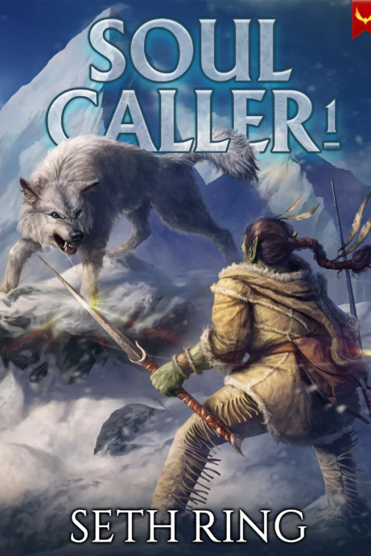
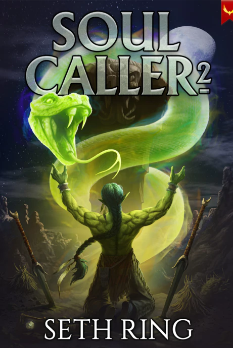

Tags: #series #soulcaller 

---
# Soul Caller

{Series Logo TBD}

Even in his own village, Merrick has always been an outsider.

He has his own way of doing things—and an unusual, instinctive connection to the Song of the World.

When a band of strangers arrive, greedy for the land's riches, Merrick takes a gamble and offers to guide the prospectors. But the expedition soon leads him into far greater danger than a simple village boy like Merrick could have imagined.

With an unpredictable Guardian Spirit by his side, Merrick must summon all his strength and courage to survive the perilous journey ahead.

## Book 1: Soul Caller 1

### Released: April 2, 2024

### Plot

A lone warrior. A world destroyed. A chance to start again.

Ever since he was little, Merrick had been blessed by the Great Spirits granting him an unusually strong connection to the Song of the World.

With his Warrior Ceremony approaching, Merrick was sure his greatest wish was about to come true, never expecting he was going to be thrown into a torrent of change that would threaten to sweep away his whole world. Invaders from another world were beginning to creep into his people’s land, intent on devouring every resource they could find, and when Merrick offers to act as a guide for a rich young prospector’s group, he finds he may have bit off more than he can chew.

## Book 2: Soul Caller 2

### Released: July 31, 2024

### Plot

Abandoned to die in the wilderness, Merrick refused to give in. Now, he’s growing stronger and is more determined than ever to drive back those who would ravage his world.

Yet he has only just begun to scratch the surface of how deeply his world has been infected, and after alerting the Empire to the danger, he planned to join the World Guard in an attempt to break the scaled beast’s hold on the mountain range.

---
## Sources
- https://sethring.com/book-series/soul-caller-series/