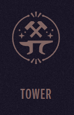
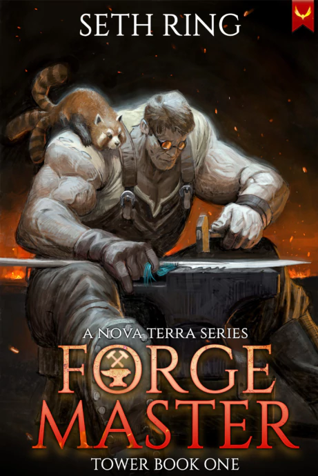
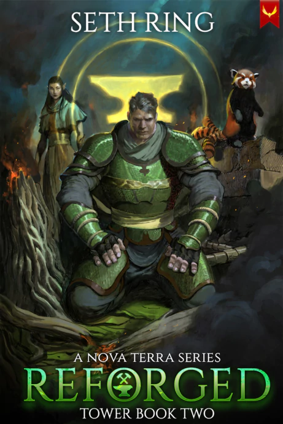
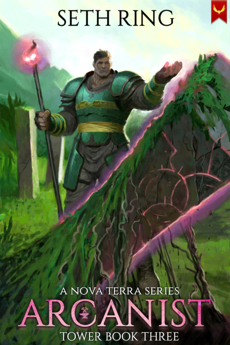
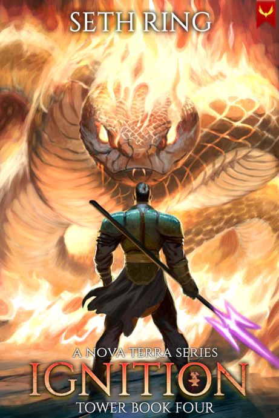
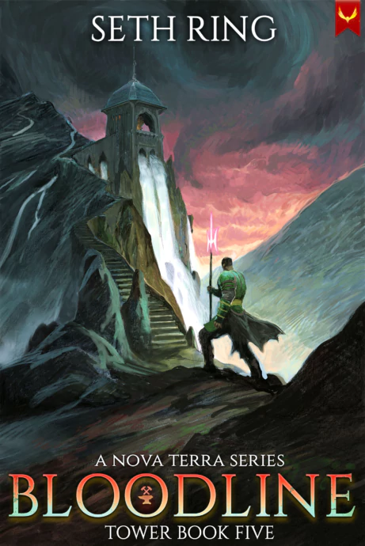
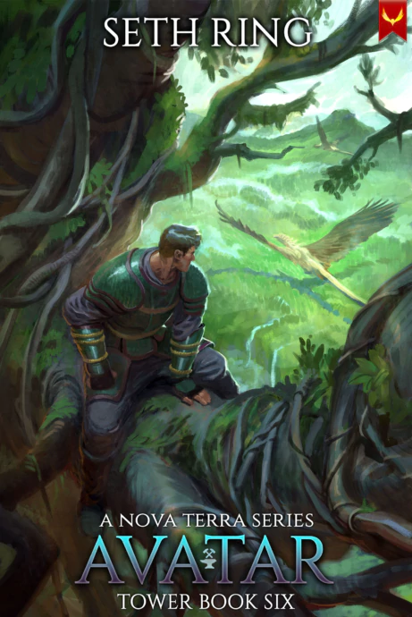
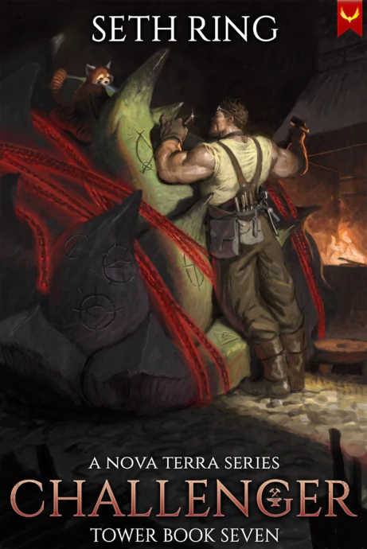

Tags: #series, #tower

---
# The Tower series (aka Nova Terra Sequel)

Thrust into a world where his legendary strength will no longer save him, Thorn must rise to new heights in the Tower series.

With a god beast as his companion, an AI for a guide, and old enemies never far behind, Thorn is forced to confront not only external threats, but the limitations of his own power.

Each step he ascends into the upper worlds reveals new dangers and arcane secrets. To survive, Thorn will have to risk his life—and the lives of those he loves.

## Book 1: Forge Master

### Released: March 7, 2023

### Plot

Ascending should have been the easy part… But after being thrown into the void, Thorn finds himself stranded in a strange world filled with even stranger creatures.

Together with his cute battle pet, the mysterious god beast Hati, and a sentient AI named Eve, Thorn must forge a place for himself in this new world. Unfortunately, the local guilds all have other ideas and soon the Titan finds himself embroiled in plots that even his famed strength cannot help him with.

## Book 2: Reforged

### Released: June 6, 2023

### Plot

Cursed and dying, Thorn has landed at a crossroad… He can either give up and die, or walk a path he never wanted to touch. Reluctantly accepting that his only chance at life rests in corrupt magic, Thorn soon finds himself exploring a world of ancient mysteries, all while trying to hide his tracks from those who want to hunt him down.

Pursued by bounty hunters intent on dragging him back in chains, Thorn soon discovers the plot is deeper than he thought. Even the Tardoff clan, one of the powerful challenger families, is intent on capturing him and extracting his knowledge of ancient runes. To make matters worse, they’re coming after him themselves.

## Book 3: Arcanist

### Released: September 6, 2023

### Plot

Safe for the moment, Thorn and Velin are faced with a choice…  
Hide among the cruel Deva, or forge a path that will require all their skill and wit, unlocking the ancient paths of power hidden in the Titan bloodline.

Ahead of them lies Intra Mundum, an endless test that requires courage, strength, and most importantly, strong bonds. As they begin to explore the floors of the tower with a hastily thrown together team, Thorn and Velin will find they have a much stronger connection than they first realized.

## Book 4: Ignition

### Released: December 6, 2023

### Plot

Life has calmed down for Thorn, and between a wonderful wife, a world to explore, and all his friends finally being in the upper worlds, he is ready to settle down.

All that changes when a mysterious doorway made from an indestructible alloy is discovered by one of the god beasts on Verdant. According to legend, it leads to a mysterious world where heroes are put through a test to determine their strength, and when Thorn and his team head through to explore it, they quickly find themselves facing more than they bargained for.

## Book 5: Bloodline

### Released: March 6, 2024

### Plot

Thorn would love to have been able to take some time off, but there is no rest for the weary.

Urmag’Tal’s Puzzle is slated to open for the first time in 100 years, and considering his connection with it, Thorn can’t afford to be absent. Heading to the Temple of Man will throw him into the whirlpool of political intrigue that dominates the city of the Saints. Even as Thorn seeks to build alliances, he finds himself gaining enemies as the forces of the Council of Gods conspire against him.

## Book 6: Avatar

### Released: July 10, 2024

### Plot

Thorn and Mina are on the hunt. All Thorn wants to do is spend time with his grandparents in Urmag’Tal’s Puzzle, learning more about what it means to be a Titan, but the universe seems determined to thwart him. When Corvo is outed as an Avatar, he and Huginn are stolen away and taken back to Beastwatch, the city of the god beasts.

Hunting and being hunted, Thorn dives head first into the taboo mystery of the god beasts and their mysterious avatars. With the clock ticking on his friend’s survival, Thorn will have to draw every ounce of power from his connection with Hati even as he uncovers secrets that threaten to undermine everything he believes about his Moon Wolf bond.

## Book 7: Challenger

### Released: January 15, 2025

### Plot

Challenger is the seventh book in the Tower Series, a GameLit/LitRPG series from Seth Ring, bestselling author of Battle Mage Farmer and The Titan Series, set in the world of Nova Terra and starring the unforgettable Thorn.

If you like immersive storytelling, rich fantasy, and epic adventures with a slice of friendship thrown in, you’ll love this page-turning series.

---
## Sources
- https://sethring.com/book-series/tower-series/