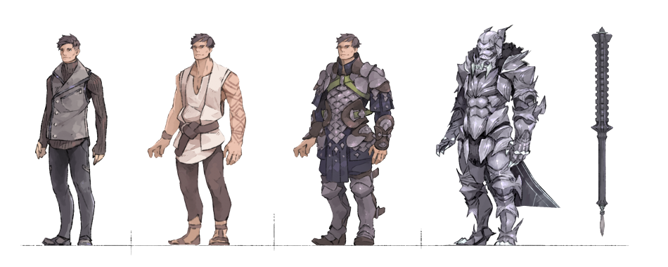

Tags: #character, #novaterra

---
# Thorn (Xavier Lee)

Standing at 8' 9", Thorn is a literal Titan. He is the in-game avatar of Xavier Lee, a 16 year old with a debilitating form of gigantism which has caused him to grow to his current dimensions. He enters Nova Terra while undergoing a radical new medical procedure that requires continuous suspended animation for two years while nanites strengthen his bones and skin. In Nova Terra his size becomes an asset rather than a drawback.

Thorn is a bright boy. Though a bit inexperienced when it comes to normal conversations, he has learned much about how to manage business and how to handle transaction negotiations due to his aunt being the nephew of his parents' company. Thorn is also incredibly warm to people, partially to ease them as those he meets are usually stunned by his enormous stature. Hemmed in and coddled by all who met him, the thing he wants the most is freedom.

## Backstory

Xavier Lee's parents led Atlas Energy, the largest energy company in the world. However, when they were driving to the hospital for the birth of Xavier, they were hit by a drunk driver. They survived just long enough to reach the hospital, but they both passed away during surgery. Xavier miraculously survived the crash and the emergency c-section. His aunt, Julia Lee, took custody of him from that day on. While leadership of Atlas went to Julia, the absurd wealth of Xavier's parents went to him.

A debilitating form of gigantism removes any possible vestiges of normalcy for Xavier. This disorder has caused his entire body to grow at an incredibly rapid rate. By the ago of two months, Xavier was able to walk, and he was almost four feet tall by the time he turned one year. As he got older, his body began to struggle supporting itself. The body tissue could hardly keep up with the large size and mass of itself. If Xavier was not careful with his movements, the contraction of his muscles would tear his skin open, leaving several small bloody trails on his body. Even though his bones and muscles—which are 32 times stronger than normal—can largely support his massive frame, gravity still makes movement difficult and causes stress on the body's joints. By the time he was eight, Xavier needed a mechanized brace to walk, and often needs to get around by wheelchair.

Since Xavier's disorder was identified early on, his life has consisted almost entirely of constant trips to various hospitals around the world. A fortune was spent on research and treatments, but everything proved to be ineffective.

In addition to this constant in-and-out of hospitals, Xavier occupied himself with study. At 16, he has finished primary and secondary school years ago and has even completed two degrees, one in Business Management and another in Urban Planning.

## Appearances

- Titan (Book #1): "Nova Terra: Titan"
- Titan (Book #2): "Nova Terra: Greymane"
- Titan (Book #3): "Nova Terra: Kingbreaker"
- Titan (Book #4): "Nova Terra: Guardian"
- Titan (Book #5): "Nova Terra: Liberator"
- Titan (Book #6): "Nova Terra: Earthshaper"
- Titan (Book #7): "Nova Terra: Stormbringer"
- Titan (Book #8): "Nova Terra: Stone King"
- Titan (Book #9): "Nova Terra: Catalyst"
- Titan (Book #10): "Nova Terra: Worldbearer"
- Tower (Book #1): "Forge Master"
- Tower (Book #2): "Reforged"
- Tower (Book #3): "Arcanist"
- Tower (Book #4): "Ignition"
- Tower (Book #5): "Bloodline"
- Tower (Book #6): "Avatar"
- Tower (Book #7): "Challenger"

## Physical Description

- Race: Human/Titan
- Gender: Male
- Height: 8' 9"
- Weight: 800lbs
- Eye color: Brown

## Relatives

- Wife: [Velin](Velin.md)
- Maternal Aunt: [Athena (Julia Lee)](Athena.md)
- Father: Kamag'tal/Philip
- Mother: Zem'tal feg/Evelyn
- Maternal Grandfather: Joseph McCallen
- Paternal Grandfather: Urmag’Tal
- Paternal Grandmother: Metra

## Images

(left to right) Real-world Xavier, Thorn upon entry to Nova Terra, Thorn upon purchasing armor, Thorn at end of Book 1

---
## Sources
- https://www.novaterra.wiki/doku.php?id=characters:thorn
