# The Titan series (aka Nova Terra)

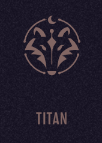

“This game is not like other games,” Thorn’s aunt warns him as the story begins.

“It’s pretty much real life and it’s as dangerous.” But after years of failed medical treatments, Thorn will try just about anything—including an experimental procedure requiring him to spend two years in the virtual world of Nova Terra.

While there, he’ll encounter enemies, ancient evil, and a forgotten god who sets Thorn on a crash course with some of the Nova Terra’s most powerful players.

## Book 1: Titan

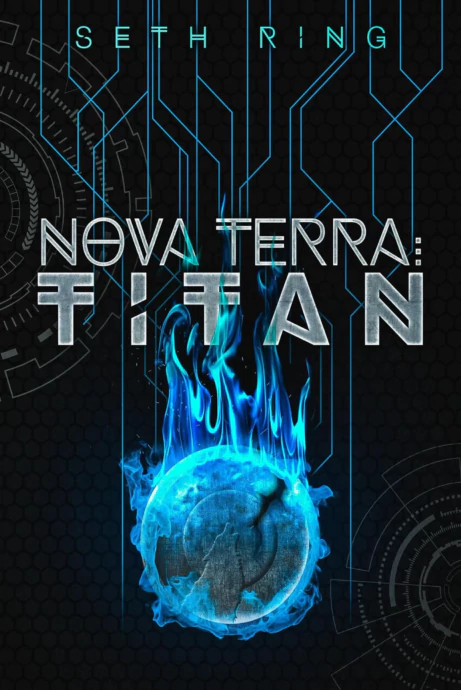

### Released: December 3, 2018

### Plot

The plot of Book 1 centers around introducing the main character Xavier/Thorn, his medical condition, and his entry into Nova Terra. Since the in-game race of a player's avatar can only be selected based on their real-world physical characteristics, Xavier's size (due to a rare form of gigantism) only allows him to play as the Titan race, entering the game as Thorn. New to role-playing games in virtual reality, Thorn is discovering things for the first time, a recurring theme in the series. A natural loner, he is initially intent on solo play and achieving success on his own terms. After a chance encounter, however, he joins a four-player team as a porter, learning much about the world of Nova Terra along the way.

## Book 2: Greymane

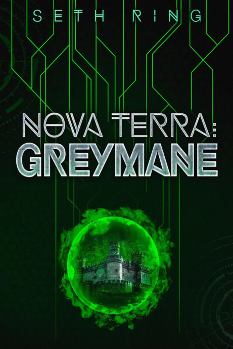

### Released: April 1, 2019

### Plot

The plot of book 2 centers around a single quest line that Thorn received during the events of book 1 related to the “Greymane” title. He also begins to build a team with some of the characters from the previous book and new characters he meets during the course of book 2. We follow Thorn as he begins to go head-to-head with some of the main players in the guild Ragnarok.

## Book 3: Kingbreaker

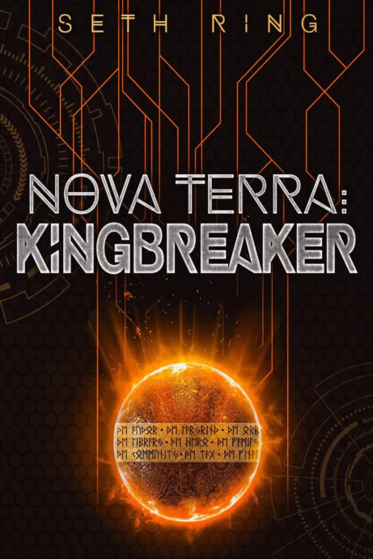

### Released: September 25, 2019

### Plot

Having defended Moon Wolf Citadel from the super guild, Ragnarok, and carved out a place for himself in Nova Terra, Thorn stands on top of the fantasy world.

But Nova Terra is not as simple as it seemed and Thorn quickly discovers the political leaders in the capital of Northern Angoril turning jealous eyes on him. The young Titan is forced to take a step back, beset by complications on every side. With players flocking to Greymane Valley, the pressure of ruling the Wolfkin grows, not helped by Ragnarok’s unrelenting attempts to destroy his fledgling guild.

## Book 4: Guardian

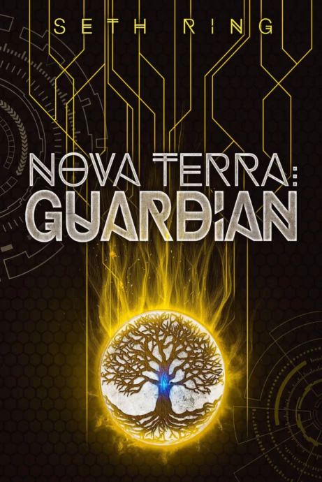

### Released: March 12, 2020

### Plot

His abilities sealed by a powerful curse, Thorn is racing against the clock to regain his voice. Will a quest across the world be the answer, or will everything he has gained be stripped away?

Thorn might be the Greymane, but after the disastrous end of the last World Quest he is in no position to rule. Heading off with his friends to seek the cure to his curse, Thorn leaves Moon Wolf Citadel behind to search for the elusive World Tree. After arriving on the other side of Angoril, Thorn and his companions realize that all is not well on the Elven Isle and are forced to flee for their lives.

## Book 5: Liberator

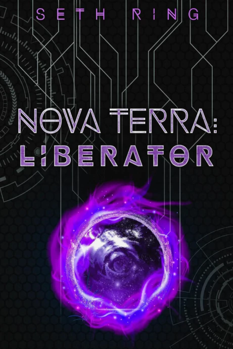

### Released: September 29, 2020

### Plot

Despite all the advantages that came with being a Titan, for Thorn, it has come with equally Titan sized problems.

Thorn has freed himself from an ancient curse and cleared up the political turmoil in the capital, but the looming threat to Northern Angoril posed by the Orc invasion of Rasyn carries him back to the Elven island. But not before he deals with a cultist infestation in his own home.

## Book 6: Earthshaper

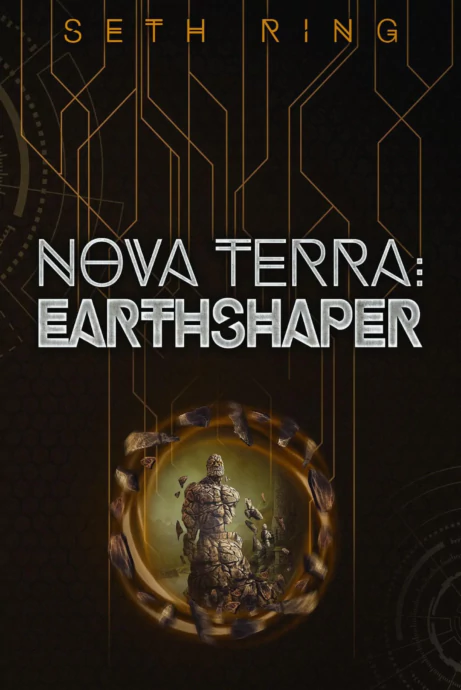

### Released: March 9, 2021

### Plot

They say it isn’t about how many times you get knocked down. Barely surviving his struggle with Arhtu the Cursed, Thorn is determined to turn his successive defeats into overwhelming victory. But first he has to fight through devilish plots, an Orc siege, and an ancient threat capable of wiping his team out without any effort.

The stakes have grown—and if Thorn is going to lead his friends through the danger of the looming Orc threat, he will need every advantage he can scrape together. Yet even as he forges a path forward shadows begin to stir.

## Book 7: Stormbringer

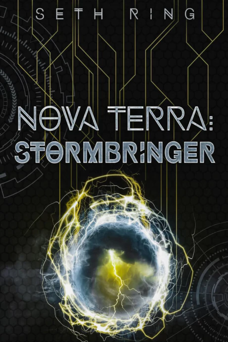

### Released: July 23, 2021

### Plot

One war has drawn to a close, but another has just begun. It was supposed to be an easy victory lap in the capital city, but life around Thorn is never that simple. New responsibilities, underhanded nobles, a shadowy cult, and a struggle for the throne of Northern Angoril all promise to make life exciting, if he can survive.

Thorn falls deeper into the political struggles of the Empire when the capital is rocked by a terrible murder and is forced to learn that not all problems can be solved with the heavy end of his tetsubo. New allies and new enemies emerge as Thorn races to stop a catastrophe that will shake the entire world of Nova Terra.

## Book 8: Stone King

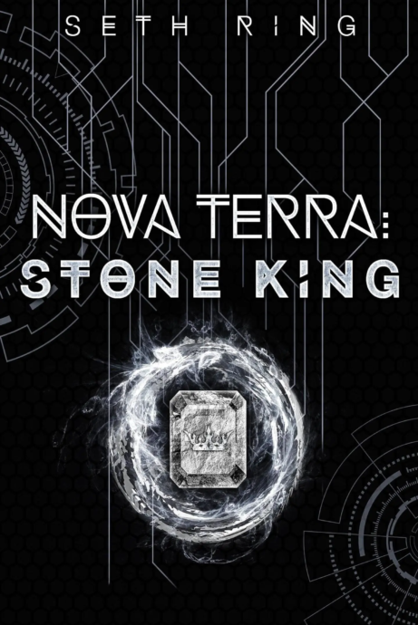

### Released: October 27, 2021

### Plot

Trapped in the Abyss by the underhanded scheme of a fallen prince, Thorn and his companions are in for a long walk through the Devil-infested wasteland.

Hunted by corrupted Devils, Thorn’s only option for making it out alive is taking a chance on the mysterious inheritance of a long dead Elven High Mage. As he races back to Angoril, he will have to figure out how to help a collapsing outpost of escaped slaves or risk being stuck in the Abyss forever.

## Book 9: Catalyst

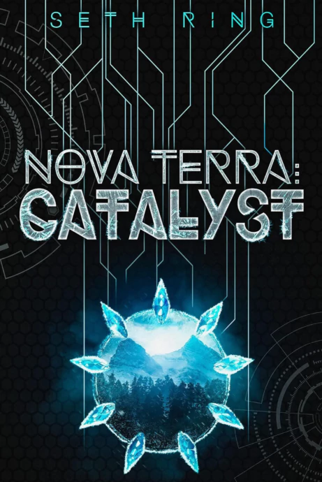

### Released: March 8, 2022

### Plot

Back from the Abyssal Lands, life is looking pretty good from where Thorn sits. Firmly established as the Stone King, Thorn has added the throne of Rakkam, the Labyrinth City, to his growing holdings.

But not everyone is so satisfied with how the game is turning out, and when a cursed staff leads Mina to disclose some of her tumultuous past, the team decides to head north. With a small team of some of the best players in the game, Thorn is off on a fast paced adventure to solve a murderous mystery left untouched for two decades.

## Book 10: Worldbearer

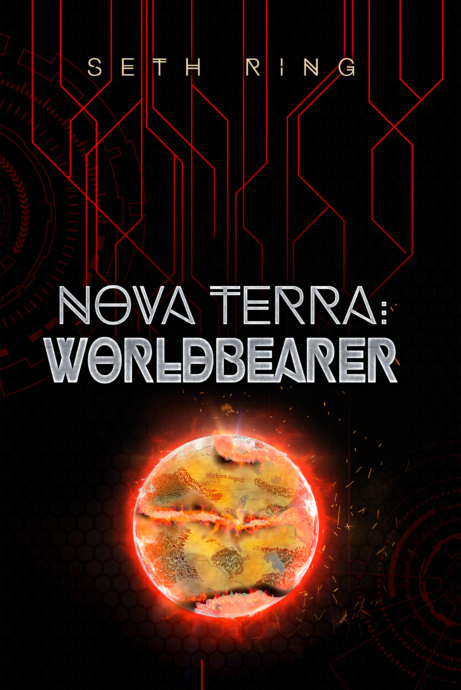

### Released: June 14, 2022

### Plot

A nation torn asunder. A world at war. A mystery that will change the world forever.

No sooner had Thorn stepped into his new role as Titan of Earth than the enemies of the Duchy pounced, their armies flooding into Ironhold. With barely enough time to plan their defense, Thorn and the Wolfkin are forced into battle against forces that outnumber them five to one.

---
## Additional

## Mad Master Alchemist

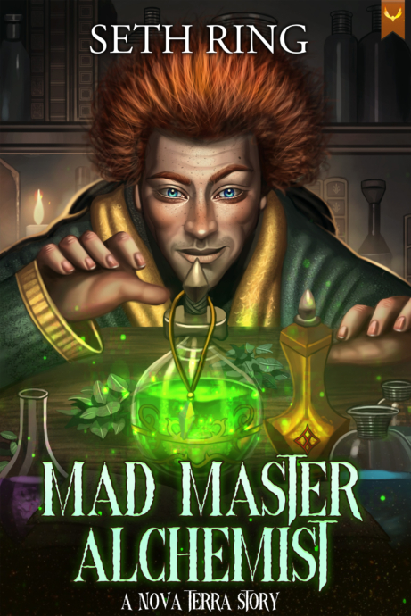

### Released: April 25, 2023

### Plot

Richt: Expert botanist. Genius chemist. Recently unemployed.

Burning down the lab will do that. But every cloud has a silver lining, and after being let go from his most recent job for unsanctioned experiments, Alph is given the chance to blow off a little steam with a cutting edge new game that isn’t even out of beta.

It’s called Nova Terra.

---
## Sources
- https://www.novaterra.wiki/doku.php?id=story
- https://sethring.com/book-series/the-titan-series/